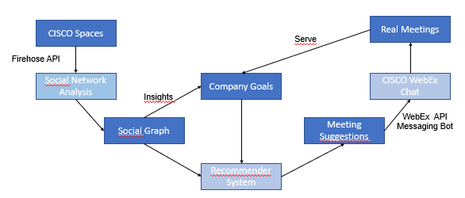

# Socialiser - connect people in companies

## A submission by team "BembelEngineers" to START Hack 2024 - CISCO Challenge

Team "BembelEngineers" from TU Darmstadt and ETH Zürich.
Members: Kevin Riehl, Leon Bernard, Benedikt Völker

We present "Socialiser", a recommender system that brings people together in companies.
Based on WiFi-Localisation data, we learn a social network graph, that is analysed to identify gaps in corporate network structure and actively suggests informal meetings for exchange and getting together.

## How it works
- Event Stream Data from CISCO Spaces is produced.
- This Stream Data is transmitted via Firehose API to our first software module "Graph Generator".
- The "Graph Generator" translates the event stream data into a social network graph (either real time or ex-post).
- The social graph yields insights for management to define company goals.
- The company goals together with the social graph are the input for the software module "Recommender System".
- The "Recommender Software" generates meeting suggestions to actively connect people to achieve company goals.
- The meeting suggestions are then sent via the WebEx Messaging Bot API to chats of the peopl in the company.
- These meeting suggestions lead to real meetings and thus serve the company goals.

## Structure of this repository
In this repository you will find three software modules.
- Folder "graphGenerator" contains a Python project that processes StreamData from CISCO Spaces via Firehose API, and generates the social network graph.
- Folder "recommederSystem" contains a Python project that analyses the social network graph and generates meeting recommendations.
- Folder "webexAPI" contains a NodeJS project that enables to send meeting invites automatically via a WebexChat Bot.
