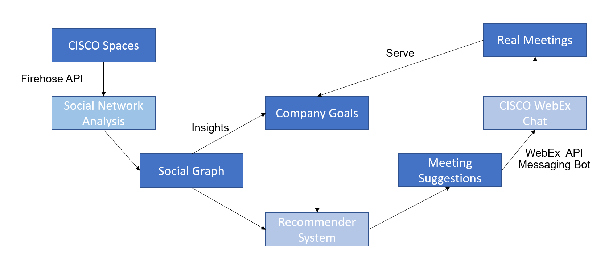

# Socialiser - connect people in companies

## A submission to START Hack 2024 - CISCO Challenge

Team "BembelEngineers" from TU Darmstadt and ETH Zürich.
Members: Kevin Riehl, Leon Bernard, Benedikt Völker

We present "Socialiser", a recommender system that brings people together in companies.
Based on WiFi-Localisation data, we learn a social network graph, that is analysed to identify gaps in corporate network structure and actively suggests informal meetings for exchange and getting together.

## How it works

## Structure of this repository

