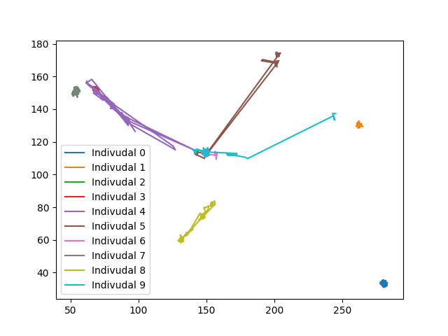

# Graph Generator

There are several steps to calculate the social network graph.

**Step 1:**  
Record the event data from CISCO Spaces via Firehose API. [1_StreamRecording.py](1_StreamRecording.py)

**Step 2:**  
The stream contains many different events. We filter the stream for the event type "IOT_TELEMETRY" and filter for the device type "IOT_BLE_DEVICE" assuming that these events represents assuming that these events represent the phones / devices of employees. [2_StreamFilter.py](2_StreamFilter.py)

**Step 3:**  
The graph generator identifies unique users in the stream, generates location-timelines for each user, and then assesses based on Euclid distance how much time employees spend together to determine the social graph. The social graph is represented as a symmetric adjacency matrix where the element of the ith row and jth column represent, how strong the connection between employees i and j is (based on the time they spent closely together). [3_GraphGenerator.py](3_GraphGenerator.py)

The following diagram shows trajectories of ten selected individuals and exhibits meeting patterns.

