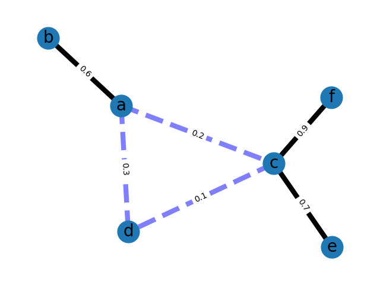

# Recommender System

The recommender system is designed to connect the *most isolated people* in the organization with the *most connected persons*. The rationale behind this is that the most connected persons can integrate the isolated ones within the company. Eventhough this recommender approach is quite simple, it can effectively help organizatins to increase bonds between employees.

# How it works

As an input, the recommender system receives an undirected graph with weighted edges. This graph represents the weighted social network that is generated based on how much time individuals spent together. 

The *most influencial persons* in the organization are evaluated based on the katz centrality. This metric represents the individuals with the highest score whos connections are also highly connected with others. The katz centrality also takes the weights between individuals into account.

The *least connected persons* are identified based on their degree centrality. This metric is based on the amount and strongness of the connections with others. 

Based on both metrics the system recommends the most isolated person to connect with the most influencial person. 

