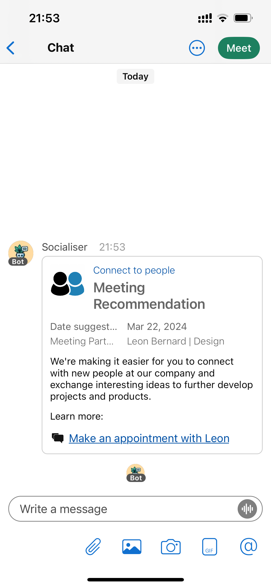

# Webex API

The WebEx API utility triggers the message that is send to the WebEx users to recommend connections.

We created a WebEx Bot called **Socialiser** that can be used via the WebEx API to send messages to individuals or groups. The users receive notifications in terms of a card that suggests the person they should meet with. 

To further enhance the the user experience, the bot can be extended by conversational functionality to better serve the users preferences. 

[WebEx Bot Starter](https://github.com/NRS-LeonBernard/webex-bot-starter)